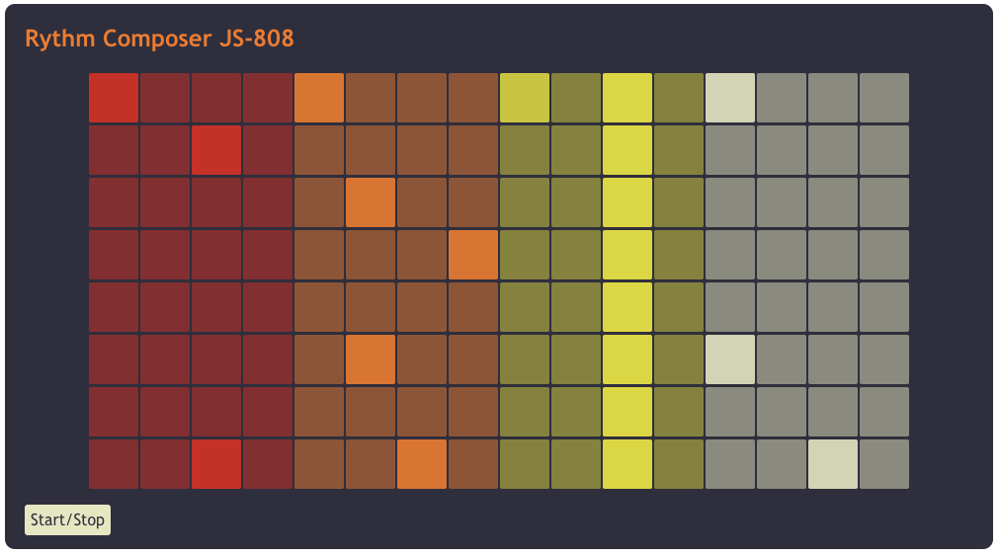

# JS-808
Simple clone of the legendary Roland TR-808 using HTML, CSS and JavaScript.

## Possible improvements
* Volume control (Individual and master)
* Sound tweaking (Pitch, etc.)
* Extended sequencer (64 steps)
* Effects (Reverb, delay, etc.)

## External libraries
* Tone.JS